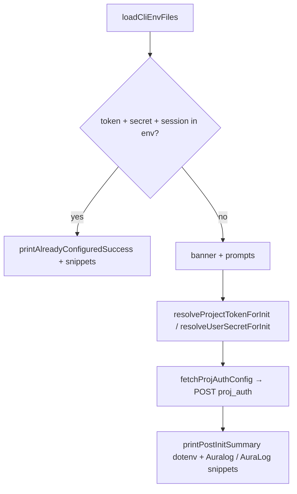
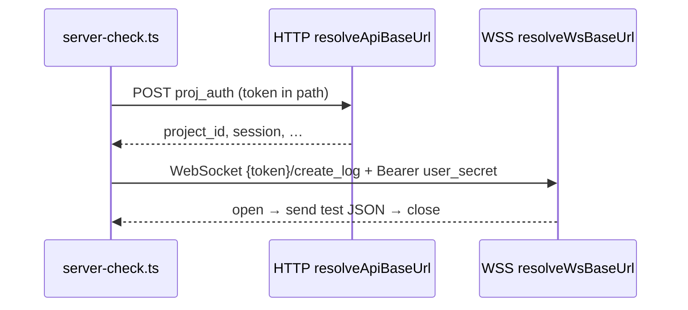
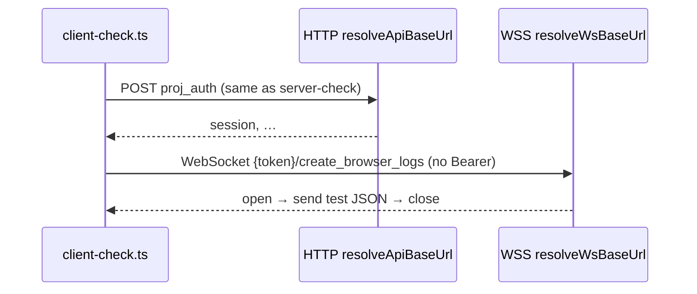
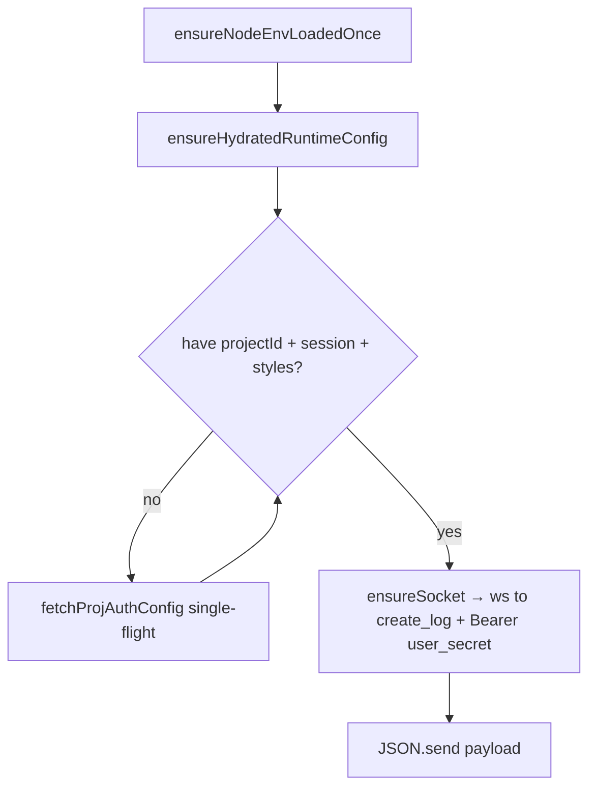
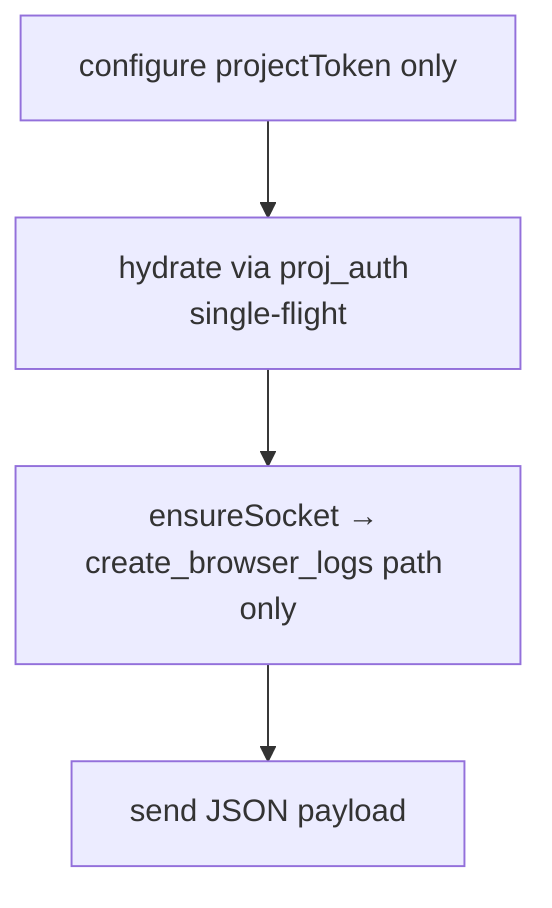

<!-- Generated: 2026-04-09 UTC -->
# Feature flows (CLI + SDK)

End-to-end paths through **`src/`** for each major capability: which files run, which HTTP/WS calls fire, and what credentials apply. Pair with **[`routes.md`](routes.md)** (paths + auth), **[`api-urls.md`](api-urls.md)** (hosts), **[`bdd.md`](bdd.md)** (observable behaviour).

---

## Credential cheat sheet

| Flow | Project token | User secret | HTTP base | WS base |
|------|----------------|-------------|-----------|---------|
| **`init`** | Path on `proj_auth`; prompt/env | Prompt/env (for dotenv copy only; not sent on `proj_auth`) | `resolveApiBaseUrl()` | — |
| **`get-logs`** | Path on `/api/{token}/logs` | Header **`secret`** (and compat `user_secret`) on that POST | `resolveApiBaseUrl()` | — |
| **`server-check`** | Path on `create_log` WS | `Authorization: Bearer` on WS | `resolveApiBaseUrl()` (`proj_auth`) | `resolveWsBaseUrl()` |
| **`client-check`** | Path on `proj_auth` + WS | Prompt/env but **not** sent on WS | `resolveApiBaseUrl()` | `resolveWsBaseUrl()` |
| **`AuraServer.log`** | Path on WS; may path on `proj_auth` | Bearer on WS; used for hydration | `resolveApiBaseUrl()` | `resolveWsBaseUrl()` |
| **`AuraClient.log`** | Path on `proj_auth` + WS | Never | `resolveApiBaseUrl()` | `resolveWsBaseUrl()` |

---

## 1. `auralogger init`

**Entry:** `cli/bin/auralogger.ts` → `runInit()` in **`cli/services/init.ts`**.



- **Network:** `POST {apiBase}/api/{encodeURIComponent(token)}/proj_auth` — no `secret` header ([`buildProjAuthUrl`](../src/utils/backend-origin.ts)).
- **UX copy:** [`cli-tone.ts`](../src/cli/utility/cli-tone.ts), [`aside-pools.ts`](../src/cli/utility/aside-pools.ts) (aside lines).

---

## 2. `auralogger get-logs`

**Entry:** `auralogger.ts` → `runGetLogs()` in **`cli/services/get-logs.ts`**.

```mermaid
flowchart TD
  A[loadCliEnvFiles] --> B[resolveGetLogsAuth]
  B --> C{styles in env?}
  C -->|yes| D[token + secret from env/prompt]
  C -->|no| E[fetchProjAuthConfig optional try/catch]
  E --> D
  D --> F[parseCommand + normalizeAndValidateFilters]
  F --> G[POST /api/{token}/logs secret=userSecret + user_secret=userSecret]
  G --> H[printLog per row via log-print + log-styles]
```

- **Network:** `buildProjectLogsUrl` + `secret: userSecret` header (and a compat `user_secret` header with the same value for older backends).
- **Filters:** [`parser.ts`](../src/cli/utility/parser.ts) → [`get-logs-filters.ts`](../src/cli/services/get-logs-filters.ts).

---

## 3. `auralogger server-check`

**Entry:** **`cli/services/server-check.ts`** → `resolveProjectContextForCliChecks()` from **`init.ts`**.



- Shared auth resolution: **`resolveProjectTokenForInit`**, **`resolveUserSecretForInit`**, **`fetchProjAuthConfig`**.

---

## 4. `auralogger client-check`

**Entry:** **`cli/services/client-check.ts`**.



---

## 5. `AuraServer.log` (Node SDK)

**Entry:** **`server/server-log.ts`** — `processServerlogAsync` after `setImmediate` scheduling.



- **Configure:** `AuraServer.configure(projectToken, userSecret)` or env; see **`syncFromSecret`** / overrides in source.
- **Console:** no local **`console.log`** on successful send; misconfiguration / network / WebSocket / send failures use **`console.error`** (see **`server-log.ts`**).

---

## 6. `AuraClient.log` (browser-safe SDK)

**Entry:** **`client/client-log.ts`** — `processClientlogAsync`.



- **No** `AURALOGGER_USER_SECRET` anywhere in this graph.
- **Console:** no local **`console.log`** on successful send; problems use **`console.error`** / **`console.warn`** (see **`client-log.ts`**).

---

## 7. `test-serverlog` / `test-clientlog`

**Entry:** **`cli/services/test-logger.ts`** — reuses the same WS + hydration patterns as **`server-check`** / **`client-check`** (multiple fake lines).

---

## Shared helpers (cross-feature)

| Export / function | Module | Used by |
|-------------------|--------|---------|
| `fetchProjAuthConfig` | `cli/services/init.ts` | init, get-logs (styles), checks, AuraServer hydrate |
| `resolveProjectContextForCliChecks` | `cli/services/init.ts` | server-check, client-check |
| `resolveApiBaseUrl`, `buildProjAuthUrl`, `buildProjectLogsUrl` | `utils/backend-origin.ts` | All HTTP above |
| `resolveWsBaseUrl` | `utils/backend-origin.ts` | WS clients |
| `loadCliEnvFiles` | `cli/utility/cli-load-env.ts` | CLI bin, AuraServer first use |
| `parseErrorBody` | `utils/http-utils.ts` | init, get-logs |

---

## When you add a new CLI command or SDK surface

1. Decide **HTTP vs WS** and **credential model**; update **[`routes.md`](routes.md)**.
2. If hosts differ from defaults, document env in **[`api-urls.md`](api-urls.md)**.
3. Add a subsection here (short diagram + file list).
4. Extend **[`file-map.md`](file-map.md)** and **[`bdd.md`](bdd.md)** if behaviour is user-visible.
